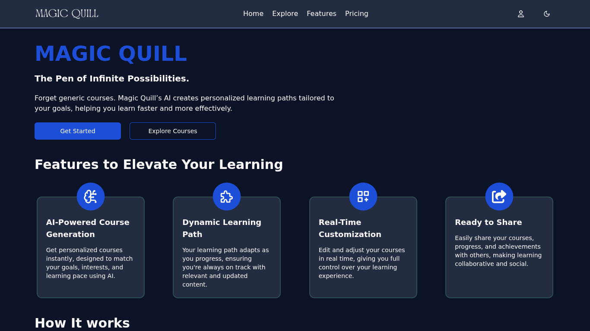

# ✨ Magic Quill – AI Course Generator

An AI-powered platform that creates fully customizable, shareable learning courses from simple user inputs.

### 🔗 [Live Demo](https://magic-quill-ai.vercel.app/)

---

## 📸 Screenshots




---

## 🎯 Features

- **AI-Powered Course Creation**
- **Authentication with Clerk**
  - Email and password
  - Google login
  - GitHub login
- **Dark & Light Theme Support**
- **Auto-generated course outlines**
- **Shareable learning experiences**

---

## 👤 How to Use (For Users)

1. Sign up using Clerk
2. Activate your account using **Google Gemini API**
3. Click on **"Create Course"**
4. Fill in course details and submit
5. Review and confirm the outline
6. Enjoy your generated course and share with others!

---

## 🛠️ How to Run (For Developers)

### 1. Clone the repository

```bash
git clone https://github.com/vicky2805vky/ai-course-generator.git
```

### 2. Install dependencies

```bash
npm install
```

### 3. Create a .env file in the root with the following variables

```
VITE_YOUTUBE_API_KEY = YOUR_YOUTUBE_API_KEY
VITE_UNSPLASH_ACCESS_KEY = YOUR_UNSPLASH_API_KEY
VITE_CLERK_PUBLISHABLE_KEY = YOUR_CLERK_API_KEY
VITE_DATABASE_URL = YOUR_NEON_DB_URL
```

### 4. Start the development server

```bash
npm start
```

### 5. Open in your browser

```bash
http://localhost:3000
```

## Technologies used

- React JS
- Typescript
- Tailwind CSS
- Shadcn UI
- Redux JS
- Clerk
- Drizzle ORM
- Neon DB
- Google Gemini

API

## 🤝 Contributing

Pull requests are welcome! For major changes, please open an issue first.
